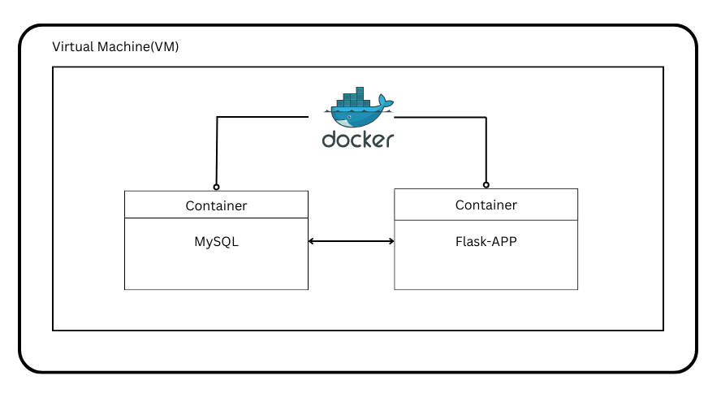

# login-signup-web
This repo is a straightforward login and signup website

---
### Intro
This repository utilizes Flask for managing backend services and MySQL as the SQL server for data storage and retrieval. Additionally, Docker is employed to transform this Flask-MySQL pipeline into a distributed system.

### Requirements
- Docker
- Flask
- MySQL
- Digital Ocean VM

### Project Structure

- This project comprises two containers:
   1. MySQL container: utilized for data storage and retrieval.
   2. Flask-APP container: responsible for managing backend services, as well as handling login and sign-out functionalities.
- Moreover, in this project, I utilized Docker Compose to facilitate seamless communication between these two containers.

### Flask-APP Flowchart

### Demo
If you are interested in this repo, please visit my demo [website](HTTP:www.wyc51.me:5050).
